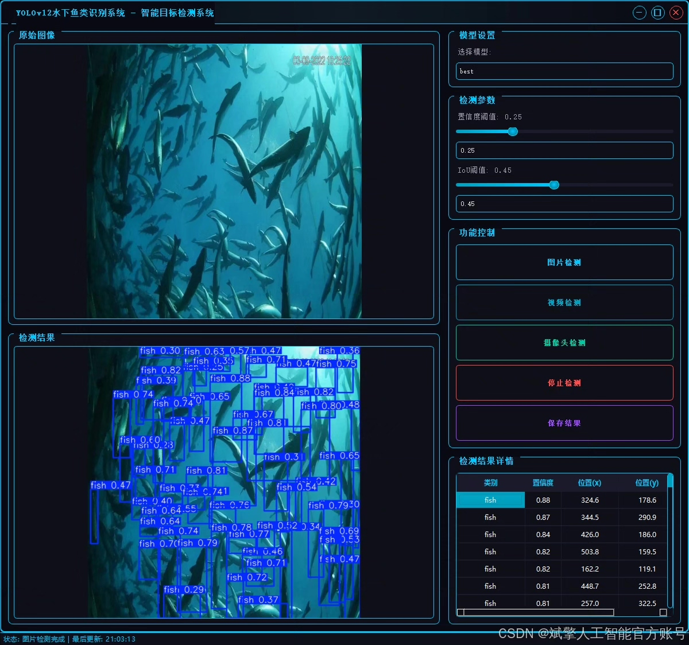
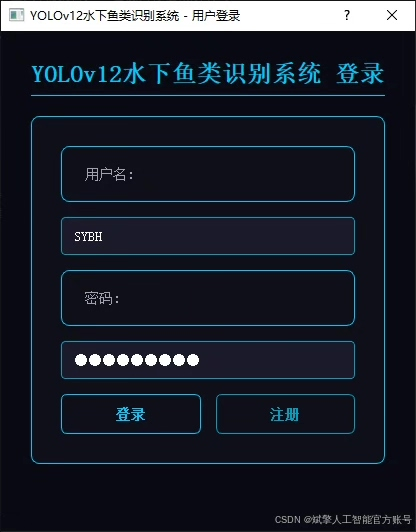
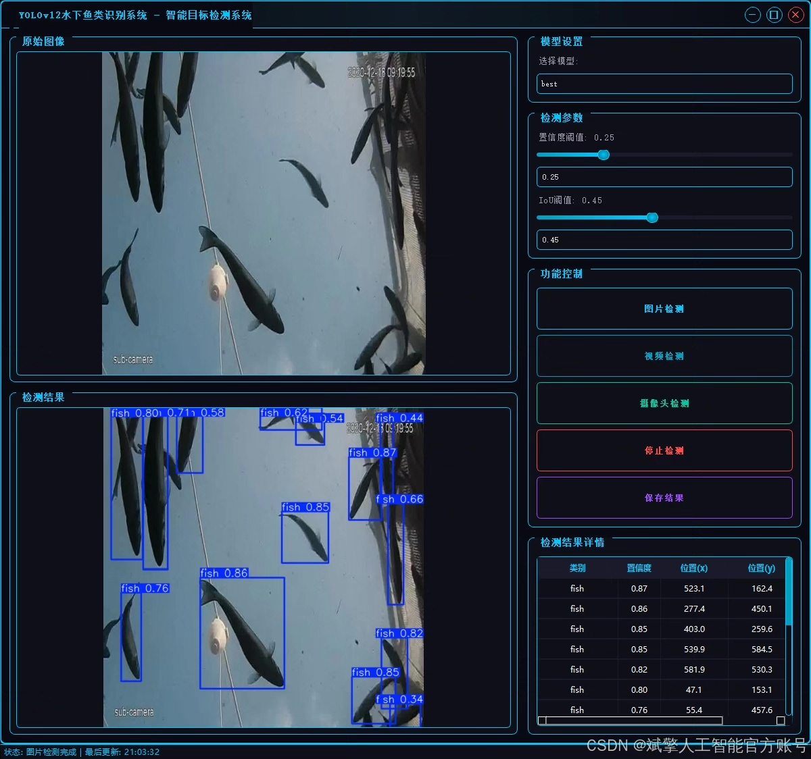
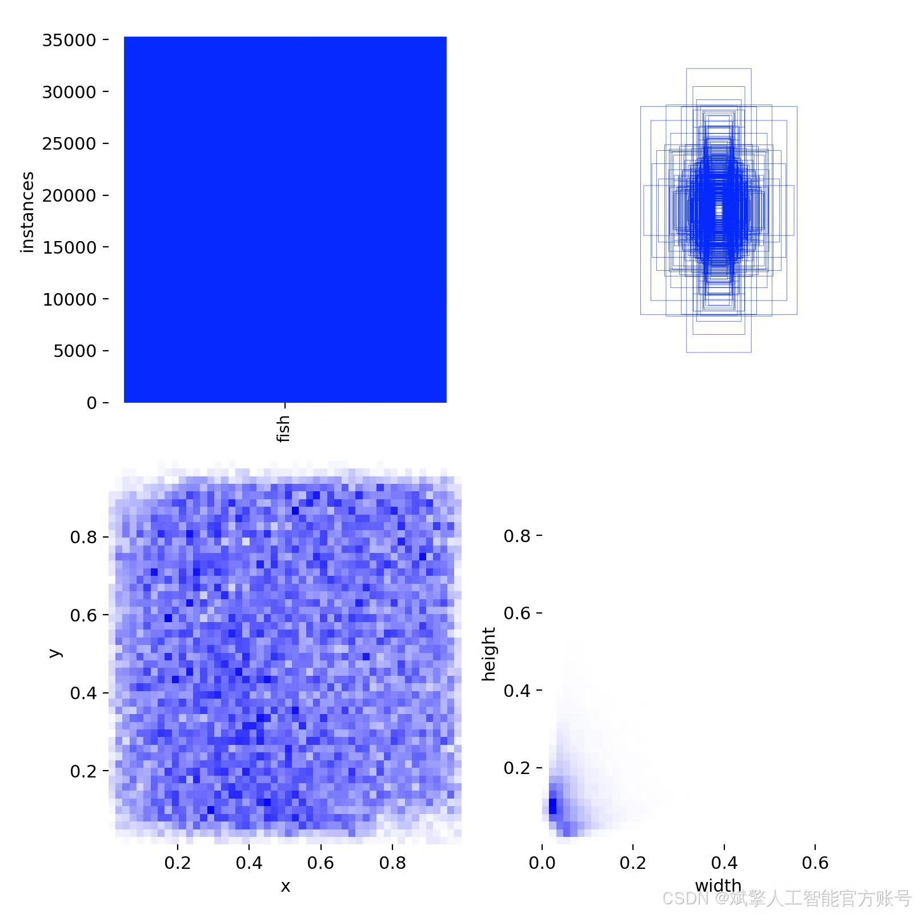
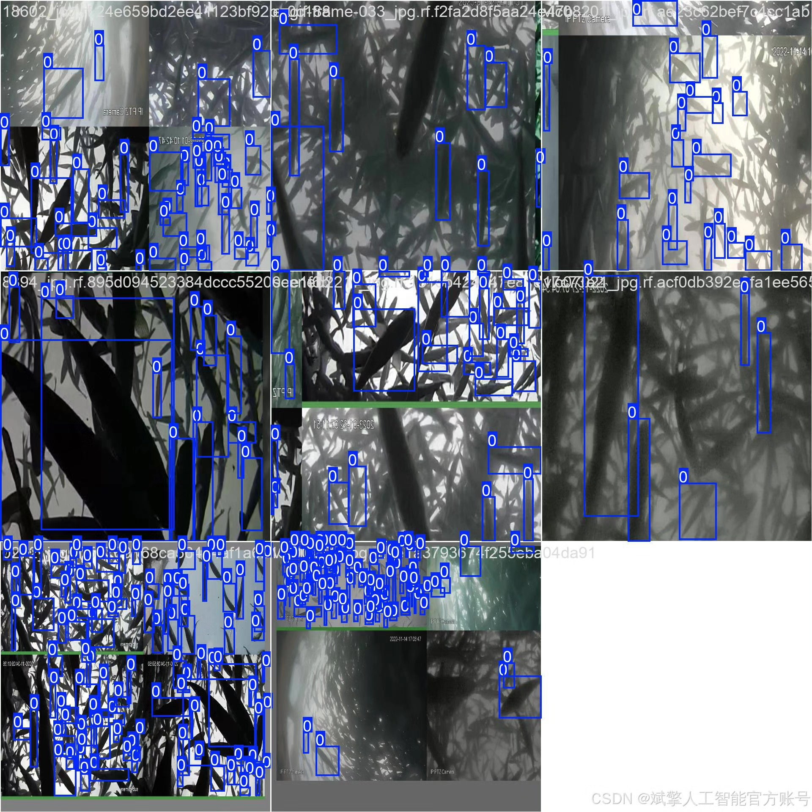
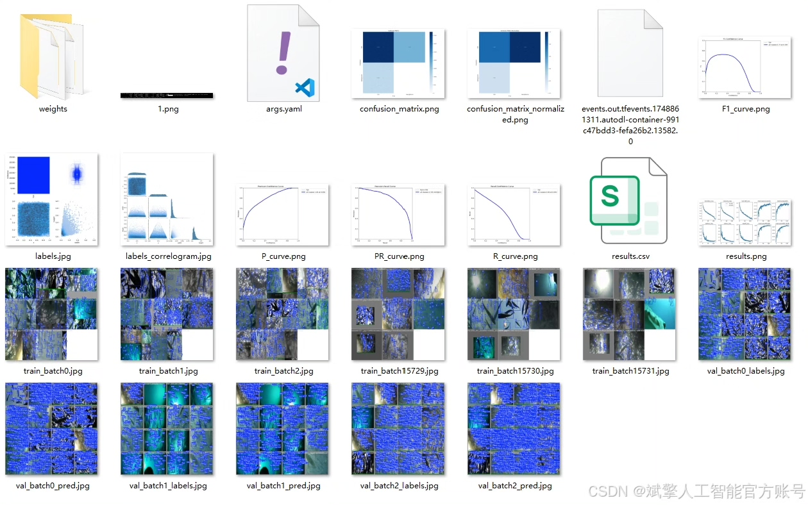
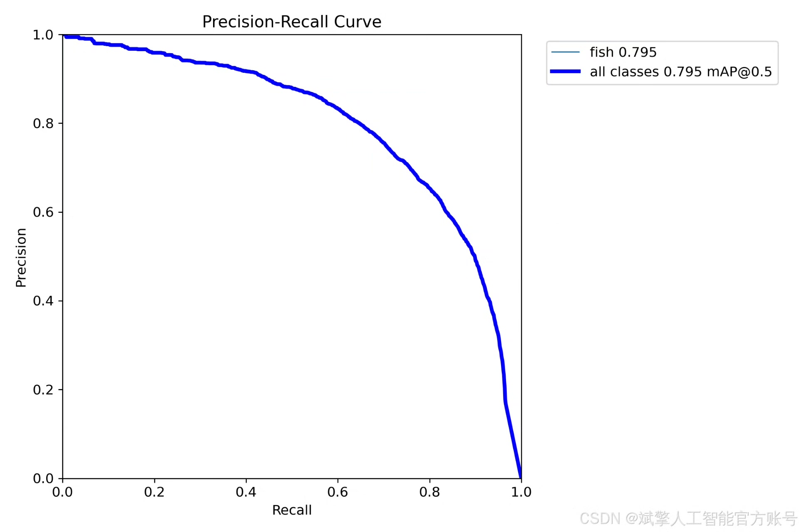
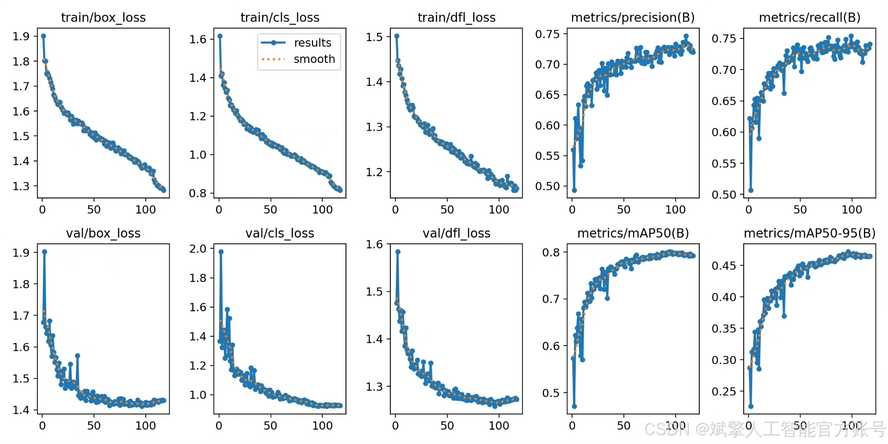
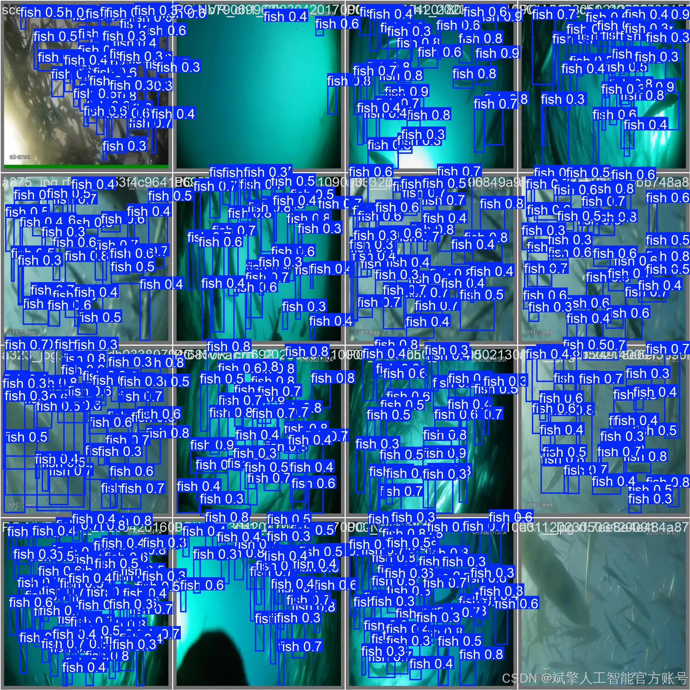

# YOLOv12 underwater fish detection system

## Body

YOLOv12 Underwater Fish Detection System Based on Deep Learning YOLOv12: A System for the Detection of Underwater Fishes (YOLOv12+YOLO dataset + UI interface + login and registration interfaces + Python project source code + model)

This project has been developed based on the YOLOv12 deep learning framework to create a system for the detection of underwater fish targets. It is focused on efficient and accurate identification of fish in underwater environments. The system uses the lightweight YOLOv12 model for real-time detection, and integrates a user-friendly UI interface that supports login and registration functions. The entire project architecture is implemented in Python, including data preprocessing, model training, evaluation, and visualization modules. To address the complex lighting and blurriness issues in underwater scenes, the model has been optimized on a custom dataset, meeting the practical needs of marine ecological research and fishery resource monitoring.

Dataset:
nc: 1 class,
name: ['fish'],
dataset quantity: 1170 training sets, 146 validation sets, 147 test sets.

✅ User Login and Registration: Supports password verification and security validation.
✅ Three detection modes: Based on the YOLOv12 model, supporting image, video, and real-time camera detection, with precise target recognition.
✅ Dual-screen comparison: Displaying original images and detection results side by side.
✅ Data Visualization: Real-time table displaying the category, confidence, and coordinates of detected targets.
✅ Intelligent parameter adjustment: Offers a confidence slide bar, dynamically optimizing detection accuracy to meet different scene requirements.
✅ Sci-fi style interactive interface: Dark theme combined with dynamic light effects, reducing visual fatigue and enhancing operational experience.

## Images

## Payment

Here is a pay link on Stripe ( https://buy.stripe.com/3cs8yP7sY87d0vu9AB ). Please contact me lonlonago@foxmail.com after funding $89, and I will send you a complete data files , thank you!

